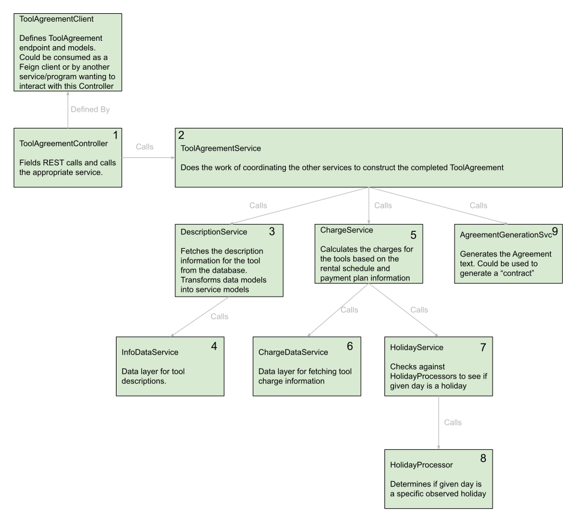

# Tool Rental application

Requirements:

- The application is a point-of-sale tool for a store, like Home Depot, that rents big tools.
- Customers rent a tool for a specified number of days.
- When a customer checks out a tool, a Rental Agreement is produced.
- The store charges a daily rental fee, whose amount is different for each tool type.
- Some tools are free of charge on weekends or holidays.
- Clerks may give customers a discount that is applied to the total daily charges to reduce the
  final charge

## Running/Demoing the Application

There is an executable .jar file at ./runnable/tool_rental.jar. Running the JAR will stand up the
spring application
and field REST calls locally on port 8080.

### Swagger

Swagger docs are automatically generated when the application is run. They can be found
at this [Swagger Doc Location](http://localhost:8080/swagger-ui/index.html). As specified in the
demo instructions, the expected
format of dates is 1-2 digit month / 1-2 digit day of month / 2 digit year. This format is expected
and may cause 500 errors if deviated from.

## Design Direction:

The direction that was chosen was probably vastly over-engineered for the ask of the project.
Yes, it could have been far simpler, but the intention here was to demonstrate SOLID, DRY,
Separation of concerns,
future thinking, and easy extensibility. It would be quite simple to take any part of the
application and separate
it out into its own microservice. With an API and controller, it could be dropped in with little or
no change to the service itself. Additionally, each service could easily be updated have additional
functionality
without affecting the services that currently consume them. Finally, Spring boot was chosen to
demonstrate
proficiency with that technology.

